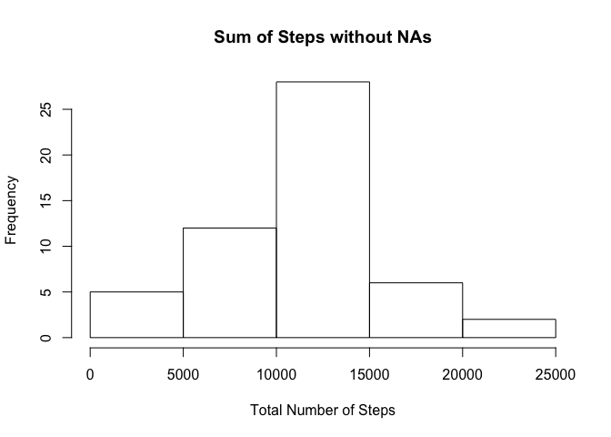
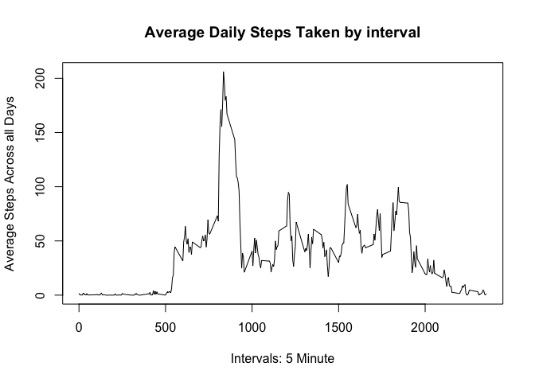
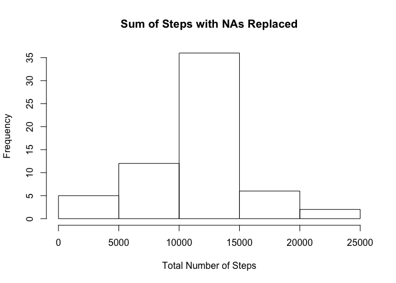
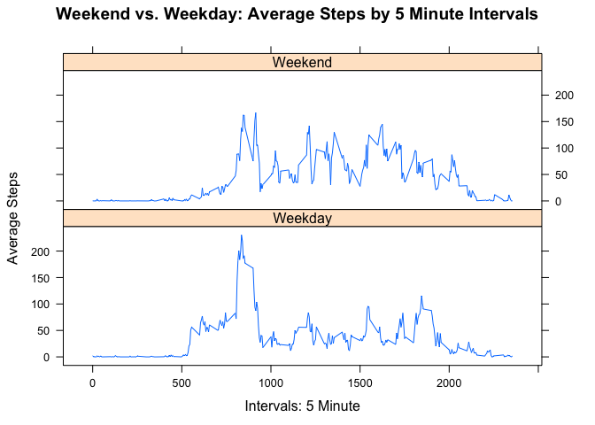

# Reproductible Research Project I: Activity Data
kamcculloch  
September 20, 2015  
#Loading and preprocessing the data


```r
if(!file.exists('activity.csv')){
    unzip('activity.zip')
}
data <- read.csv("activity.csv")
library("lubridate")
library("lattice")
```
#What is mean total number of steps taken per day?
## 1.Calculate the total number of steps taken per day
In order to answer this questions, we first have to manipulate the data: aggregating to show the sum of steps taken by day.

```r
data$date <- as.Date(data$date)
StepsAgg <- aggregate(steps ~ date, data, sum, na.rm = TRUE)
```
## 2.Make a histogram of the total number of steps taken each day
Now, lets make a histogram to get a sense of the distribution.

```r
hist(StepsAgg$steps, 
     main = "Sum of Steps without NAs", 
     xlab = "Total Number of Steps")
```

 
## 3.Calculate and report the mean and median of the total number of steps taken per day
We can see that the distirbution is approximately normal, slighly positively skewed, so it will be interesting to see how close the mean and median are to eachother.

```r
mean(StepsAgg$steps)
```

```
## [1] 10766.19
```

```r
median(StepsAgg$steps)
```

```
## [1] 10765
```
As suspected, the mean and median are extremely close, with the mean slightly higher than the median.
#What is the average daily activity pattern?
## 1. Make a time series plot (i.e. type = "l") of the 5-minute interval (x-axis) and the average number of steps taken, averaged across all days (y-axis)
Again, we will use the aggregate function to get a slightly different cut- now we aggregate by interval.

```r
StepsIntAvg <- aggregate(steps ~ interval, data, mean, na.rm = TRUE)
```
Now lets Plot the the function to see the average daily activity pattern:

```r
plot(StepsIntAvg$interval,StepsIntAvg$steps, type="l", 
    main = "Average Daily Steps Taken by interval",
    xlab = "Intervals: 5 Minute", 
    ylab = "Average Steps Across all Days")
```

 
As we want to see the intervals with the highest steps, lets sort the data and get a look at the top intervals.
## 2. Which 5-minute interval, on average across all the days in the dataset, contains the maximum number of steps?

```r
Max <-  StepsIntAvg[order(-StepsIntAvg$steps),]
head(Max)
```

```
##     interval    steps
## 104      835 206.1698
## 105      840 195.9245
## 107      850 183.3962
## 106      845 179.5660
## 103      830 177.3019
## 101      820 171.1509
```
As we can see, the 835 interval is the highest, followed by 840, 850, etc. Interesting to see the highest intervals clustered around the mid 800's.
# Imputing missing values
## 1.Calculate and report the total number of missing values in the dataset (i.e. the total number of rows with NAs)

```r
NAs <- sum(is.na(data))
NAs
```

```
## [1] 2304
```
## 2. Devise a strategy for filling in all of the missing values in the dataset. The strategy does not need to be sophisticated. For example, you could use the mean/median for that day, or the mean for that 5-minute interval, etc.
Lets use the average number of steps for a given interval, as we've already calculated it and it seems like a good approximation for the missing values. We will do this by creating a for loop, checking row by row for NAs in the steps column, and if there is an NA, we overide the steps value with the average value for that interval.

```r
RepNA <- numeric()
for (i in 1:nrow(data)) {
  Rep <- data[i, ]
  if (is.na(Rep$steps)) {
    steps <- subset(StepsIntAvg, interval == Rep$interval)$steps
  } else {
    steps <- Rep$steps
  }
  RepNA <- c(RepNA, steps)
}
```
## 3. Create a new dataset that is equal to the original dataset but with the missing data filled in.

```r
DataNAReplace <- data
DataNAReplace$steps <- RepNA
```
## 4. Make a histogram of the total number of steps taken each day and Calculate and report the mean and median total number of steps taken per day.

```r
DataNAReplaceAgg <- aggregate(steps ~ date, DataNAReplace, sum)
hist(DataNAReplaceAgg$steps, 
     main = "Sum of Steps with NAs Replaced", 
     xlab = "Total Number of Steps")
```

 

```r
mean(DataNAReplaceAgg$steps)
```

```
## [1] 10766.19
```

```r
median(DataNAReplaceAgg$steps)
```

```
## [1] 10766.19
```
Here we can see that the using the interval is likely a good approximation, as the data is fairly similar shown by the histogram and given the fact that the new mean is the same and the new median is very close, and leads to an even more normal distribution, as now the mean = median.
#Are there differences in activity patterns between weekdays and weekends?
## 1. For this part the weekdays() function may be of some help here. Use the dataset with the filled-in missing values for this part.

```r
days <-wday(DataNAReplace$date)
daylevel <- vector()
```
## 2. Create a new factor variable in the dataset with two levels – “weekday” and “weekend” indicating whether a given date is a weekday or weekend day.
In order to replace, I chose to use the lubridate wday function- as I can more easily subset the weekends/weekdays as they are now numeric. Fill in the new vector by using a for loop: going over the wday vector and if the value is bewteen >1 & <7, label it as a weekday, and label everything else (1 or 7) as a weekend.

```r
for (i in 1:nrow(DataNAReplace)) {
  if (days[i] >1 & days[i] <7) {
    daylevel[i] <- "Weekday"
  } else {
    daylevel[i] <- "Weekend"
  }
}
DataNAReplace$daylevel <- daylevel
```
## 3. Make a panel plot containing a time series plot (i.e. type = "l") of the 5-minute interval (x-axis) and the average number of steps taken, averaged across all weekday days or weekend days (y-axis). 

```r
NewStepsAgg <- aggregate(steps ~ interval + daylevel, DataNAReplace, mean)
xyplot(steps ~ interval | daylevel, NewStepsAgg, type = "l", layout = c(1, 2), 
    main = "Weekend vs. Weekday: Average Steps by 5 Minute Intervals",
    xlab = "Intervals: 5 Minute", 
    ylab = "Average Steps")
```

 
